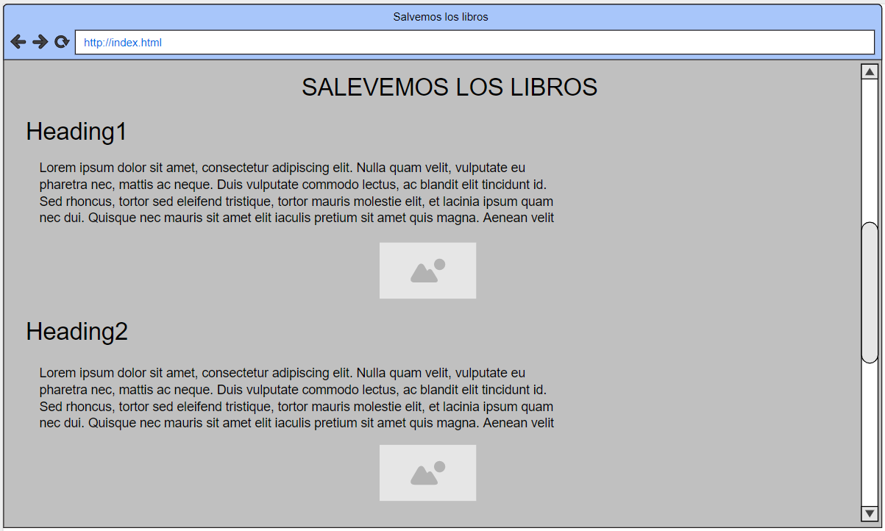
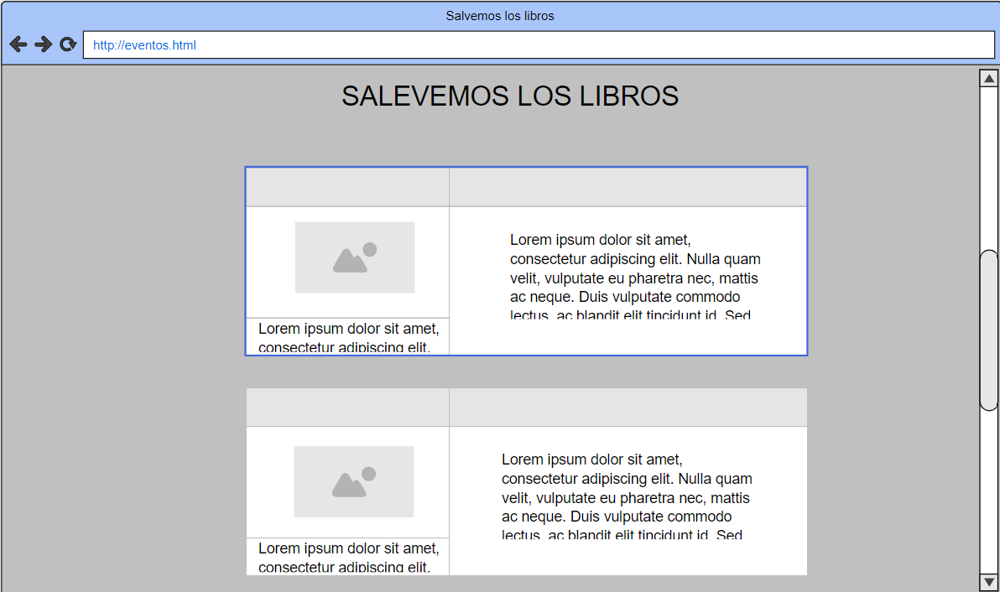
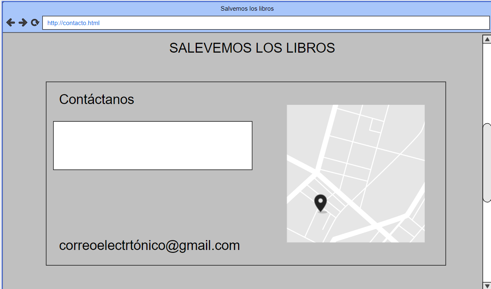
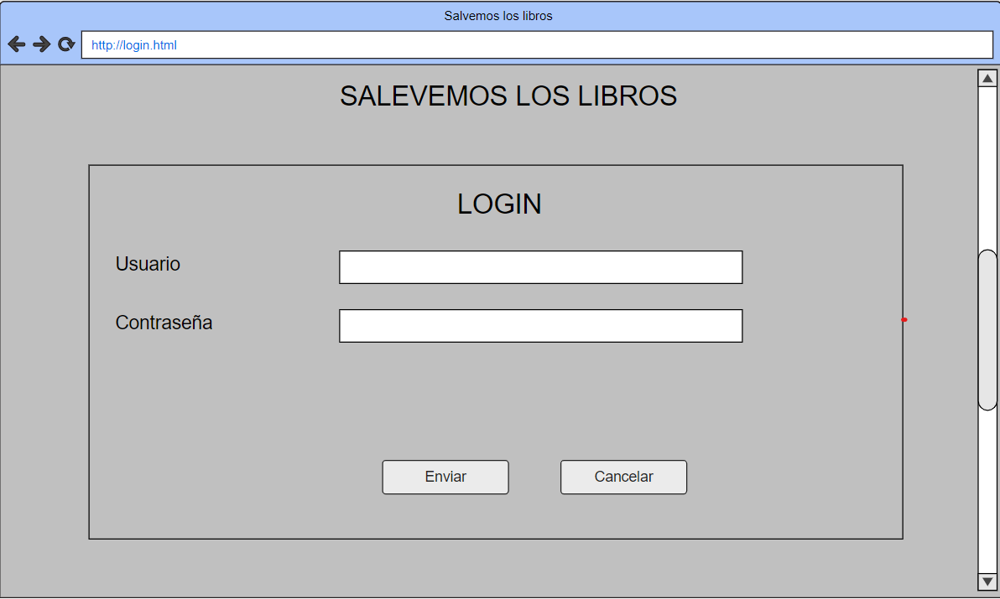

# iaw22-salvar-los-libros

En este proyecto estoy haciendo una página para la donación de los libros que no utilizamos a otros lugares donde se necesiten.

Los colores utilizados son cadetblue y lightslategray.

Las fuentes utilizadas son Reem Kufi Fun para los títulos y Noto Sans JP para el texto.

A continuación las fotos de moqups

